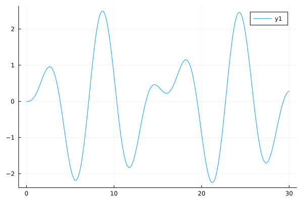
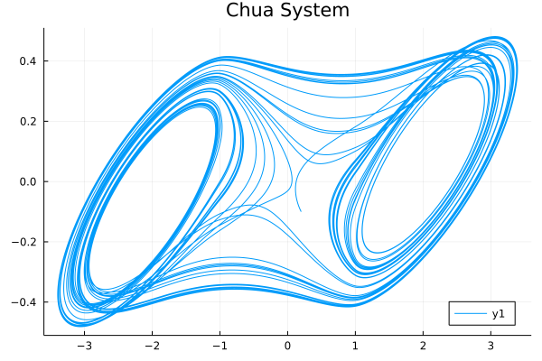
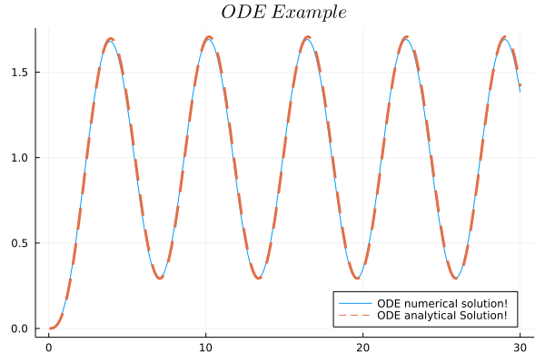

# FractionalDiffEq.jl

<p align="center">

</p>


<p align="center">
  <a href="https://github.com/SciFracX/FractionalDiffEq.jl/actions?query=workflow%3ACI">
    
  </a>
  <a href="https://codecov.io/gh/SciFracX/FractionalDiffEq.jl">
    
  </a>
  <a href="https://scifracx.github.io/FractionalDiffEq.jl/dev/">
    
  </a>
  <a href="https://github.com/SciFracX/FractionalDiffEq.jl/blob/master/LICENSE">
    
  </a>
  <a href="https://zenodo.org/badge/latestdoi/420992306">
  	
  </a>
</p>

<p align="center">
  <a href="https://github.com/SciFracX/FractionalDiffEq.jl/issues">
    
  </a>
  <a href="#">
    
  </a>
  <a href="https://github.com/SciFracX/FractionalDiffEq.jl/network">
    
  </a>
</p>

# Installation

If you have already installed Julia, you can install FractionalDiffEq.jl in REPL using Julia package manager:

```julia
pkg> add FractionalDiffEq
```

Or if you want to experience the latest version of FractionalDiffEq.jl:

```julia
pkg> add FractionalDiffEq#master
```

# Quick start

### An easy example

Let's see if we have an initial value problem:

<p align="center">


</p>

<p align="center">


</p>


So we can use FractionalDiffEq.jl to solve the problem:

```julia
fun(x, y) = 1-y
u0=0;T=5;h=0.001
prob = SingleTermFODEProblem(fun, 0.5, u0, T)
result = solve(prob, h, PECE())
tspan = collect(0:h:T)
```

And if you plot the result, you can see the result of the fractional differential equation:


### A sophisticated example

Let's see if the initial value problem like:

<p align="center">


</p>

<p align="center">


</p>

```julia
using FractionalDiffEq
using Plots, LaTeXStrings

s="\$ A\\ complicated\\ example \$"

T=30;h=0.05
tspan = collect(0.05:h:T)
rightfun(x) = 172/125*cos(4/5*x)
prob = MultiTermsFODEProblem([1, 1/16, 4/5, 3/2, 1/25, 6/5], [3, 2.5, 2, 1, 0.5, 1], rightfun) #pass the parameters vector and the orders vector
result = solve(prob, h, T, FODEMatrixDiscrete())
plot(tspan, result, title=s, legend=:bottomright)
```

Or use the [example file](https://github.com/SciFracX/FractionalDiffEq.jl/blob/master/examples/complicated_example.jl) to plot the numerical approximation, we can see the FDE solver in FractionalDiffEq.jl is amazingly powerful:



### System of Fractional Differential Equations:

FractionalDiffEq.jl is a powerful tool to solve system of fractional differential equations:

Let's see if we have a Chua chaos system:

<p align="center">


</p>

By using the ```NonLinearAlg``` algorithms to solve this problem:

```julia
using FractionalDiffEq
using Plots

function chua(t, x, k)
    a=10.725
    b=10.593
    c=0.268
    m0=-1.1726
    m1=-0.7872

    if k==1
        f=m1*x[1]+0.5*(m0-m1)*(abs(x[1]+1)-abs(x[1]-1))
        y=a*(x[2]-x[1]-f)
        return y
    elseif k==2
        y=x[1]-x[2]+x[3]
        return y
    elseif k==3
        y=-b*x[2]-c*x[3]
        return y
    end
end

α = [0.93, 0.99, 0.92];
x0 = [0.2; -0.1; 0.1];
h = 0.001;
prob = SystemOfFDEProblem(chua, α, x0)
tn = 200;
result = solve(prob, h, tn, NonLinearAlg())

gr()
plot(result[:, 1], result[:, 2], title="Chua System", legend=:bottomright)
```

And plot the result:



## Fractional Partial Differential Equations

Fractional provide powerful algorithms to solve fractional partial differential equations, let's see a diffusion example here:

<p align="center">


</p>

With initial and boundry conditions:

<p align="center">


</p>

By using the FPDE solvers in FractionalDiffEq.jl and plot the numerical approximation:


### ODE Example

FractionalDiffEq.jl is also able to solve ordinary differential equations~ Let's see an example here:

<p align="center">


</p>

<p align="center">


</p>


```julia
using FractionalDiffEq
using Plots, LaTeXStrings

s="\$ODE\\ Example\$"

T = 30
h = 0.05
tspan = collect(h:h:T)

f(x) = 1/2*(-exp(-x)-sin(x)-cos(x)+2)
target =f.(tspan)

rightfun(x) = sin(x)
prob = MultiTermsFODEProblem([1, 1], [2, 1], rightfun)
result = solve(prob, h, T, FODEMatrixDiscrete())

plot(tspan, result, title=s, legend=:bottomright, label="ODE Numerical Solution!")

plot!(tspan, target, lw=3,ls=:dash,label="ODE Analytical Solution!")
```



# Available Solvers

For more performant solvers, please refer to the [FractionalDiffEq.jl Solvers](https://scifracx.org/FractionalDiffEq.jl/dev/algorithms/) page.
# Road map

* More performant algorithms
* Better docs
* More interesting ideas~

# Contributing

If you are interested in Fractional Differential Equations and Julia, welcome to raise an issue or file a Pull Request!!