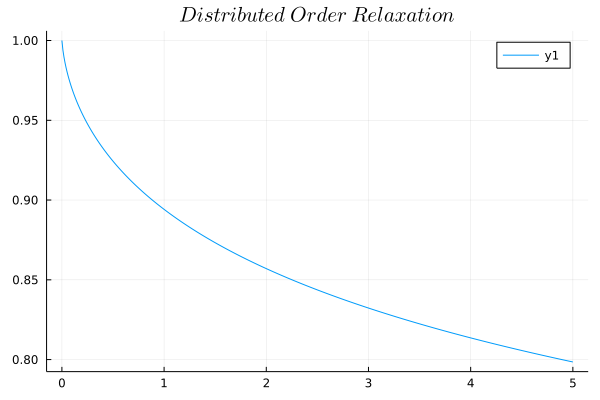

# Distributed Order Differential Equations

> For more details about distributed order diffeerntial equations and distributed order dynamic systems, we recommend you to read [Distributed-Order Dynamic Systems](https://doi.org/10.1007/978-1-4471-2852-6)

We integrate ``{_0D_t^\alpha f(t)}`` with respect to the order, we can obtain distributed-order differential/integral equations. Since we normally adopted the notation as:

```math
{_0D_t^{\omega(\alpha)} f(t)} := \int_{\gamma_1}^{\gamma_2}\omega(\alpha){_0D_t^\alpha f(t)}d\alpha
```

We can write the general form of distributed order differential equations as:

```math
\int_0^m \mathscr{A}(r,\ D_*^r u(t))dr = f(t)
```

Similar to what we have learned about single-term and multi-term fractional differential equations in linear fractional differential equations, we can also write the single-term distributed order differential equations:

```math
D_*^ru(t)=f(t,\ u(t))
```

And multi-term distributed order differential equations

```math
\sum_{i=1}^k \gamma_i D_*^{r_i}u(t) = f(t,\ u(t))
```

## Example1: Distributed order relaxation

The distributed order relaxation equation is similar to fractional relaxation equation, only the order is changed to a distributed function. Let's see an example here, the distributed order relaxation:

```math
{_0D_t^{\omega(\alpha)} u(t)}+bu(t)=f(t),\quad x(0)=1
```

With a distribution of orders ``\alpha``: ``\omega(\alpha)=6\alpha(1-\alpha)``

By using the ```DOMatrixDiscrete``` method to solve this problem:

!!! info
    The usage of ```DOMatrixDiscrete``` method is similar to the ```FODEMatrixDiscrete``` method, all we need to do is to pass the parameters array and order array to the problem definition and solve the problem.
    !!! tip
        Pass the weight function and other orders to the order array in the right way:
        ```julia-repl
        julia> orders = [x->x*(1-x), 1.2, 3]
        3-element Vector{Any}:
          #3 (generic function with 1 method)
         1.2
         3
        ```

```julia
using FractionalDiffEq, Plots
h = 0.01; t = collect(h:h:5);
fun(t)=0
prob = DODEProblem([1, 0.1], [x->6*x*(1-x), 0], (0, 1), fun, 1, t)
sol = solve(prob, h, DOMatrixDiscrete())
plot(sol)
```



## Example2: Distributed order oscillator

When the damping term in Bagley-Torvik equation described by a distributed-order derivative, we get the distributed order oscillator equation:


```math
ay''(t)+by^{\omega(\alpha)}(t)+cy(t)=f(t)
```

```math
f(t)=\begin{cases}
8, & (0\leq t\leq1)\\
0, & (t>1)
\end{cases}
```


```julia
using FractionalDiffEq, Plots
h=0.075; t=collect(0:h:30)
f(t) = 0 ≤ t ≤ 1 ? (return 8) : (return 0)
prob=DODEProblem([1, 1, 1], [2, x->6*x*(1-x), 0], (0, 1), f, [0; 0], t)
sol=solve(prob, h, DOMatrixDiscrete())
plot(sol)
```


> Please see [Distributed-Order Dynamic Systems](https://link.springer.com/book/10.1007/978-1-4471-2852-6) for systematic introduction and knowledge.