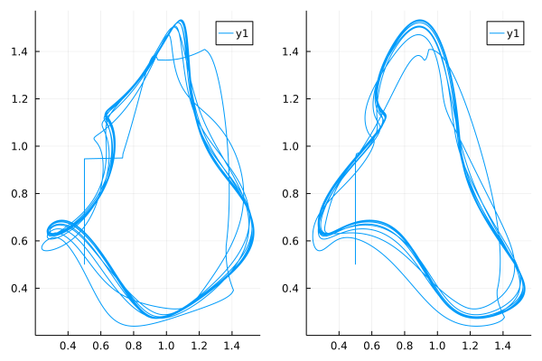
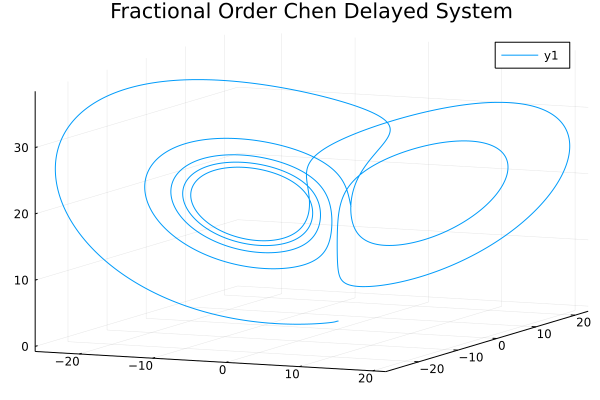
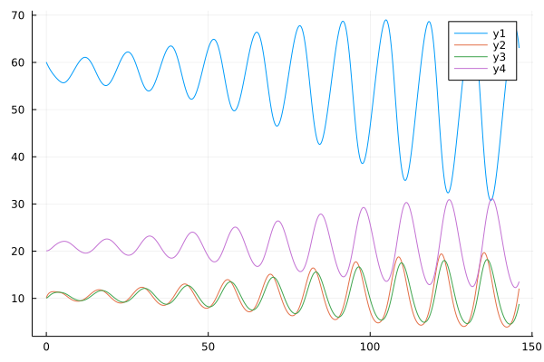

# Fractional Order Delay Differential Equations

In real world systems, delay is very often encountered in many practical systems, such as automatic control, biology, economics and long transmission lines. The delayed differential equation is used to describe these dynamical systems. Fractional order delay differential equations as the generalization of the delay differential equations, provide more freedom when we describing these systems, let's see how we can use FractionalDiffEq.jl to accelerate the simulation of fractional order delay differential equations.

The fractional delay differential equations has the general form:

```math
D^\alpha_ty(t)=f(t,\ y(t),\ y(t-\tau)),\quad t\geq\xi
```

```math
y(t)=\phi(t),\quad t\in[\xi-\tau,\ \xi]
```

While only given the initial condition is not enough to solve the delay differential equations, a history function ``\phi(t)`` must be provided to describe the history of the system(``\phi(t)`` should be a continuous function).

All we need to do is to pass the function ``f(t,\ y(t),\ y(t-\tau))``, and history function ``\phi(t)`` to the ```FDDEProblem``` definition:

```julia
prob = FDDEProblem(f, ϕ, α, τ, T)
```

And choose an algorithm to solve problem.

Here, we consider the fractional order version of the four year life cycle of a population of lemmings[^1] (A classical test example for delay differential equations):

```math
D^\alpha_ty(t)=3.5y(t)(1-\frac{y(t-0.74)}{19}),\ y(0)=19.00001
```

```math
y(t)=19,\ t<0
```

```julia
using FractionalDiffEq, Plots
ϕ(x) = x == 0 ? 19.00001 : 19.0
f(t, y, ϕ) = 3.5*y*(1-ϕ/19)
h = 0.05; α = 0.97; τ = 0.8; T = 56
fddeprob = FDDEProblem(f, ϕ, α, τ, T)
V, y = solve(fddeprob, h, DelayPECE())
plot(y, V, xlabel="y(t)", ylabel="y(t-τ)")
```


## FDDE with multiple lags

As for FDDE with multiple lags, we need to specify the lag terms by entering the array of lags ``\tau``, and call the `DelayPECE` method to solve the multiple lags FDDE.

```math
{_0^CD_t^\alpha}y(t)=\frac{2y(t-2)}{1+y(t-2.6)^{9.65}}-y(t)\\

y(t)=0.5,\ t\leq0
```

```julia
using FractionalDiffEq, Plots
α = 0.95; ϕ(x) = 0.5
τ = [2, 2.6]
fun(t, y, ϕ1, ϕ2) = 2*ϕ1/(1+ϕ2^9.65)-y
prob = FDDEProblem(fun, ϕ, α, τ, 100)
delayed, y = solve(prob, 0.01, DelayPECE())

p1=plot(delayed[1, :], y)
p2=plot(delayed[2, :], y)
plot(p1, p2, layout=(1, 2))
```




## FDDE with variable order

Variable order fractional differential operators give modeling more freedom when we describe the systems. FractionalDiffEq.jl can solve FDDE with variable order derivative no matter single lags or multiple lags. To provide a comprehensive interface, all we need to do is just defining customized ```FDDEProblem``` according to our model.

```julia
FDDEProblem(f, ϕ, α, τ, tspan)
```

we can pass ```α``` as a ```Number``` or a ```Function``` to tell FractionalDiffEq.jl it it is a normal constant fractional order FDDE or variable order FDDE.

## System of FDDE

Time delay [Chen system](https://en.wikipedia.org/wiki/Multiscroll_attractor) as a famous chaotic system with time delay, has important applications in many fields. As for the simulation of time delay FDDE system, FractionalDiffEq.jl is also a powerful tool to do the simulation, we would illustrate the usage via code below:

```math
\begin{cases}
D^{\alpha_1}x=a(y(t)-x(t-\tau))\\
D^{\alpha_2}y=(c-a)x(t-\tau)-x(t)z(t)+cy(t)\\
D^{\alpha_3}z=x(t)y(t)-bz(t-\tau)
\end{cases}
```

```julia
using FractionalDiffEq, Plots
α=[0.94, 0.94, 0.94]; ϕ=[0.2, 0, 0.5]; τ=0.009; T=1.4; h=0.001
function delaychen!(dy, y, ϕ, t)
	a=35; b=3; c=27
	dy[1] = a*(y[2]-ϕ[1])
	dy[2] = (c-a)*ϕ[1]-y[1]*y[3]+c*y[2]
	dy[3] = y[1]*y[2]-b*ϕ[3]
end
prob = FDDESystem(delaychen!, ϕ, α, τ, T)
sol=solve(prob, h, DelayABM())
plot(sol, title="Fractional Order Chen Delayed System")
```



Let's see an detailed example of the fractional order version of enzyme kinetics with an inhibitor molecule:

```math
D_t^\alpha y_1(t)=10.5-\frac{y_1(t)}{1+0.0005y_4^3(t-4)}\\
D_t^\alpha y_2(t)=\frac{y_1(t)}{1+0.0005y_4^3(t-4)}-y_2(t)\\
D_t^\alpha y_3(t)=y_2(t)-y_3(t)\\
D_t^\alpha y_4(t)=y_3(t)-0.5y_4(t)\\
y(t)=[60, 10, 10, 20],\ t\leq0
```

```julia
using FractionalDiffEq, Plots
function EnzymeKinetics!(dy, y, ϕ, t)
    dy[1] = 10.5-y[1]/(1+0.0005*ϕ[4]^3)
    dy[2] = y[1]/(1+0.0005*ϕ[4]^3)-y[2]
    dy[3] = y[2]-y[3]
    dy[4] = y[3]-0.5*y[4]
end
q = [60, 10, 10, 20]; α = [0.95, 0.95, 0.95, 0.95]
prob = FDDESystem(EnzymeKinetics!, q, α, 4, 150)
sol = solve(prob, 0.01, DelayABM())
plot(sol)
```




## Fractional matrix differential equations with delay

FractionalDiffEq.jl is also capable of solving fractional matrix delay differential equations:

```math
D_{t_0}^\alpha\textbf{x}(t)=\textbf{A}(t)\textbf{x}(t)+\textbf{B}(t)\textbf{x}(t-\tau)+\textbf{f}(t)
```

Here ``\textbf{x}(t)`` is vector of states of the system, ``\textbf{f}(t)`` is a known function of disturbance.

We explain the detailed usage by using an example:

```math

\textbf{x}(t)=\begin{pmatrix} x_{1}(t) \\ x_{2}(t) \\ x_{3}(t) \\ x_{4}(t) \end{pmatrix}

```

```math

\textbf{A}=\begin{pmatrix} 0 & 0 & 1 & 0 \\ 0  & 0 & 0 & 1 \\ 0  & -2 & 0 & 0 \\ -2 & 0 & 0 & 0 \end{pmatrix}

```

```math

\textbf{B}=\begin{pmatrix} 0 & 0 & 0 & 0 \\ 0  & 0 & 0 & 0 \\ -2 & 0 & 0 & 0 \\ 0 & -2 & 0 & 0 \end{pmatrix}

```

With initial condition:

```math
\textbf{x}_0(t)=\begin{pmatrix} \sin(t)\cos(t) \\ \sin(t)\cos(t) \\ \cos^2(t)-\sin^2(t) \\ \cos^2(t)-\sin^2(t) \end{pmatrix}
```

By using the ```MatrixForm``` method for FDDE in FractionalDiffEq.jl and plot the phase portrait:

```julia
using FractionalDiffEq, Plots

tspan = (0, 70); τ=3.1416; h=0.01; α=0.4
x0(t) = [sin(t)*cos(t); sin(t)*cos(t); cos(t)^2-sin(t)^2; cos(t)^2-sin(t)^2]
A=[0 0 1 0; 0 0 0 1; 0 -2 0 0; -2 0 0 0]
B=[0 0 0 0; 0 0 0 0; -2 0 0 0; 0 -2 0 0]
f=[0; 0; 0; 0]

prob = FDDEMatrixProblem(α, τ, A, B, f, x0, tspan)
sol=solve(prob, h, MatrixForm())
plot(sol[:, 1], sol[:, 3])
```


[^1]: [A PREDICTOR-CORRECTOR SCHEME FOR SOLVING NONLINEAR DELAY DIFFERENTIAL EQUATIONS OF FRACTIONAL ORDER, Sachin Bhalekar and Varsha Daftardar-Gejji](https://www.researchgate.net/profile/Sachin-Bhalekar-2/publication/245538900_A_Predictor-Corrector_Scheme_For_Solving_Nonlinear_Delay_Differential_Equations_Of_Fractional_Order/links/53ea02980cf2dc24b3caf95a/A-Predictor-Corrector-Scheme-For-Solving-Nonlinear-Delay-Differential-Equations-Of-Fractional-Order.pdf)