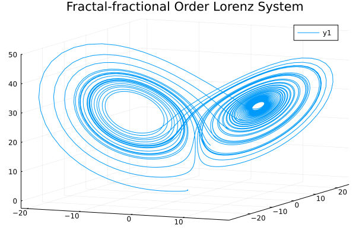
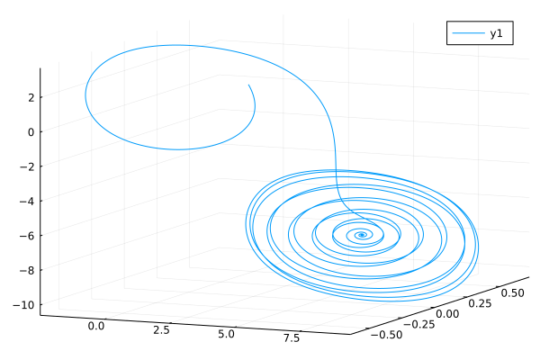

# Fractal-Fractional Order Ordinary Differential Equations

The concept of fractal–fractional differentiation has appeared as a combination of two
mathematical concepts: fractal differentiation and fractional differentiation. These operators are helpful for modeling more complex problems, also
they allow us to understand many physical problems which have fractal properties.


Fractal-fractional derivative with power law:

```math
{^{FFP}_aD^{\gamma,\theta}_t}u(t)=\frac{1}{\Gamma(1-\gamma)}\frac{d}{dt^\theta}\int_a^tu(y)(t-y)^{-\gamma}dy,\ 0<\gamma, \theta\leq1
```

Fractal-fractional derivative with exponential decay kernel:

```math
{^{FFE}_aD^{\gamma,\theta}_t}u(t)=\frac{M(\gamma)}{\Gamma(1-\gamma)}\frac{d}{dt^\theta}\int_a^tu(y)\exp(\frac{-\gamma}{1-\gamma}(t-y))dy,\ 0<\gamma, \theta\leq1
```

Fractal-fractional derivative with Mittag Leffler kernel:

```math
{^{FFM}_aD^{\gamma,\theta}_t}u(t)=\frac{AB(\gamma)}{\Gamma(1-\gamma)}\frac{d}{dt^\theta}\int_a^tu(y)E_\gamma(\frac{-\gamma}{1-\gamma}(t-y))dy,\ 0<\gamma, \theta\leq1
```


## Fractal-fractional ODE system

To construct fractal-fractional differential problems, we need to use ```FFODEProblem``` to define our problem:

```julia-repl
FFODEProblem(f, [α, β], u0, tspan)
```

Let's see the Lorenz system in **Atangana-Baleanu-Caputo** sense:

```math
\begin{cases}
{^{FFM}D^{\alpha,\beta}}x=a(y-x)\\
{^{FFM}D^{\alpha,\beta}}y=(b-z)x-y\\
{^{FFM}D^{\alpha,\beta}}z=xy-cz
\end{cases}
```

```julia
using FractionalDiffEq, Plots
α=1;β=1;h=0.01;tspan=(0, 50)
u0 = [-2, 1, -1]
function fun(du, u, p, t)
    a=10;b=28;c=8/3
    du[1] = a*(u[2]-u[1])
    du[2] = (b-u[3])*u[1]-u[2]
    du[3] = u[1]*u[2]-c*u[3]
end
prob = FFODEProblem(fun, [α, β], u0, tspan)
sol = solve(prob, h, AtanganaSeda())
plot3d(sol[1, :], sol[2, :], sol[3, :], title="Fractal-fractional Order Lorenz System")
```



## Variable order fractal-fractional ODE problem

```julia
using FractionalDiffEq, Plots

alpha=0.96;h=0.01;tfinal=100;
β(t) = 0.01+0.01*t
u0=[-0.2; 0.5; 0.2]
function fun(du, u, p, t)
    gama=10.814;lambda=14;a=0.2;b=0.15;
    du[1] = gama*(u[2]-a*sin(2*pi*b*u[1]))
    du[2] = u[1]-u[2]+u[3]
    du[3] = -lambda*u[2]
end

prob = FFODEProblem(fun, [alpha, β], u0, (1, tfinal))
result = solve(prob, h, AtanganaSeda())
plot3d(result[1, :], result[2, :], result[3, :])
```

