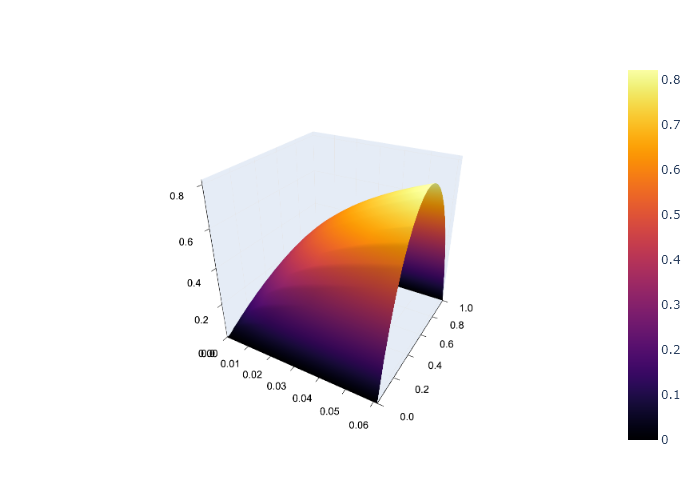
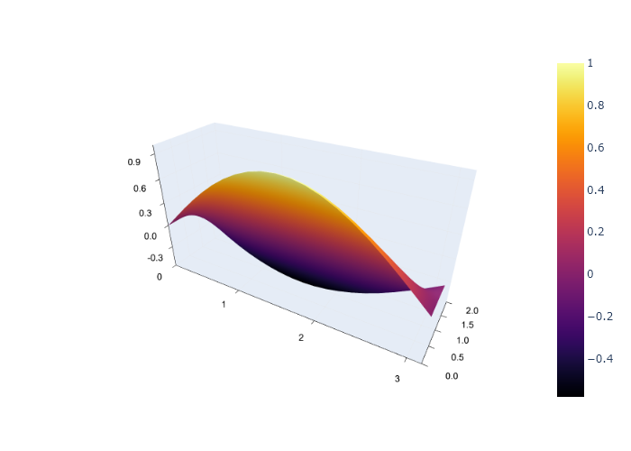

# Fractional Order Partial Differential Equations

Several models of physical and biological processes are better described using fractional PDEs than the corresponding integer-order PDEs. They serve as a generalization of the integer-order PDEs and give some degree of freedom in varying the rate of change of these physical and biological processes.

FractionalDiffEq.jl has support for solving fractional partial differential equations. Let's see an example here:

Time fractional differential equation:

```math
_{0}^{C}\!D_{t}^{\alpha}y - \frac{\partial^\beta y}{\partial |x|^\beta} = f(x,t)
```

With initial and boundry conditions:

```math
y(0,t) = 0, \quad y(1,t) = 0 \qquad  \quad y(x, 0) = 0
```

We can use the ```FPDEMatrixDiscrete``` algorithm to solve this problem:

```julia
using FractionalDiffEq, Plots

α = 0.7
β = 1.8
κ = 1
T = 2
m = 21
n = 148

result = solve(α, β, κ, T, m, n, FPDEMatrixDiscrete())

XX, YY = meshgrid(0.05^2/6 .*(0:147), 0:0.05:1)

plotlyjs()

plot(XX, YY, result, st=:surface)
```



## Time fractional diffusion equation

When we are modeling our problems, **time fractional derivative** maybe more suitable for our model, which changes the diffusion equation to **Diffusion equation with time fractional derivative**

```math
^C_0D^\alpha_tu=\kappa\frac{\partial^2u}{\partial x^2}
```

```math
y(0,t) = 0, \quad y(1,t) = 0 \qquad  \quad y(x,0) = \sin(x)
```

Here, ``\kappa`` is the [diffusion coefficient](https://en.wikipedia.org/wiki/Mass_diffusivity)

The solution of this Diffusion equation is given[^1] as:

```math
u(x, t) = E_\alpha(-t^\alpha)\sin(x)
```

Here ``E_\alpha(-t^\alpha)`` is the Mittag Leffler function.

```julia
using FractionalDiffEq

K = 1
α = 1.9
dx = pi/20
dt = 0.01
n = 2
xStart = 0
xEnd = pi
u0t = 0
uendt = 0
u0(x) = sin(x)

using Plots
plotlyjs()
U=solve(α, dx, dt, xStart, xEnd, n, K, FiniteDiffEx())
plot(x, t, U, st=:surface)
```




## Fractional partial differential equations with time delay.

As the generalization of [DPDE](http://www.scholarpedia.org/article/Delay_partial_differential_equations), FDPDE is also an interesting topic in fractional differential equations.

To solve FDPDE problem with FractionalDiffEq.jl, we need to define our ```FDPDEProblem```.

[^1]: [Exact solutions for time-fractional diffusion-wave equations by decomposition method](https://doi.org/10.1088/0031-8949%2F75%2F1%2F008)