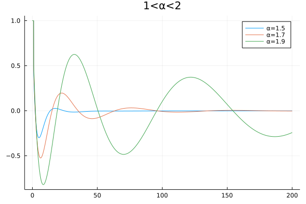

# Mittag Leffler function

> For more intreresting topics and applications about Mittag Leffler function, we recommend you to read [Mittag-Leffler Functions, Related Topics and Applications](https://link.springer.com/book/10.1007/978-3-662-43930-2)

Being called "The Queen Function of the Fractional Calculus", Mittag Leffler function plays an important role in fractional order computing and modeling. Here, we classify the Mittag Leffler function into three types:

### Classical Mittag Leffler function(Single-Parametric version)

The [Mittag Leffler function](https://en.wikipedia.org/wiki/Mittag-Leffler_function) is defined by [Gösta Magnus Mittag-Leffler](https://en.wikipedia.org/wiki/G%C3%B6sta_Mittag-Leffler) by a power series as:

```math
E_\alpha(z)=\sum_{k=0}^{\infty}\frac{z^k}{\Gamma(\alpha k+1)},\ (\alpha\in\mathbb{C})
```

### Two-Parametric Mittag Leffler function

The two-parametric Mittag Leffler function as the generalization of the classical Mittag Leffler function :

```math
E_{\alpha,\ \beta}(z)=\sum_{k=0}^{\infty}\frac{z^k}{\Gamma(\alpha k+\beta)},\ (\mathfrak{Re}(\alpha)>0,\ \beta\in\mathbb{C})
```

### Three-Parametric Mittag Leffler function

FractionalDiffEq.jl also supports the three-parametric Mittag Leffler function:

```math
E_{\alpha,\ \beta}^\gamma(z)=\sum_{k=0}^{\infty}\frac{(\gamma)_k z^k}{k!\Gamma(\alpha k+\beta)},\ (\mathfrak{Re}(\alpha)>0,\ \mathfrak{Re}(\beta)>0,\ \gamma\in\mathbb{C})
```

Here ``(\gamma)_k=\frac{\Gamma(\gamma+k)}{\Gamma(\gamma)}`` is the [Pochhammer symbol](https://en.wikipedia.org/wiki/Falling_and_rising_factorials).

In FractionalDiffEq.jl, you can compute the three types of Mittag Leffler functions by calling:

```julia-repl
julia> mittleff(α, z)
julia> mittleff(α, β, z)
julia> mittleff(α, β, γ, z)
```

Also, you can compute the derivative of the Mittag Leffler function by calling:

```julia-repl
julia> mittleffderiv(α, β, z)
```

To compute Mittag Leffler function error:

```julia-repl
julia> mittlefferr(α, z, ρ)
julia> mittlefferr(α, β, z, ρ)
```

Here, ```ρ``` is the targeting accuracy.

Different order classical Mittag Leffler function plot(``0<\alpha<1``):


And also ``1<\alpha<2``:

