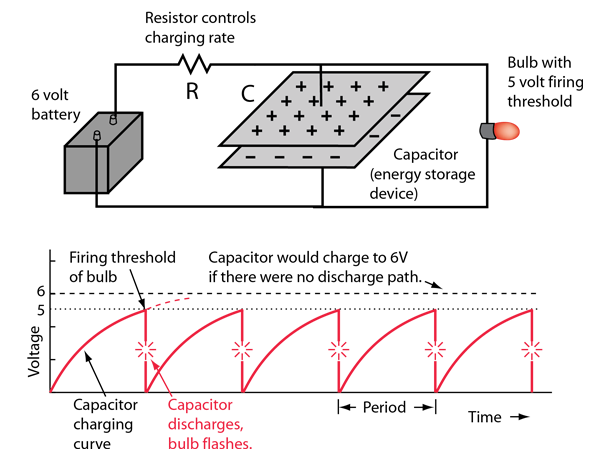

# Detailed Models

## Diffusion equation.

### Diffusion equation

**Diffusion equation** is a classical partial equation widely used in Physics to describe **density fluctuations** in a material undergonig diffusion.

```math
\frac{\partial u}{\partial t}=\nabla\cdot(\kappa \nabla u)
```

Here, $\kappa$ is the [diffusion coefficient](https://en.wikipedia.org/wiki/Mass_diffusivity) which is spatially-dependent. When $\kappa$ is a constant, **Diffusion equation** evolves to **[Heat equation](https://en.wikipedia.org/wiki/Heat_equation)**:

```math
\frac{\partial u}{\partial t}=\kappa\nabla^2u
```

The Diffusion Equation belongs to [Partial Differential Equations](https://en.wikipedia.org/wiki/Partial_differential_equation), and there are many amazing organizations and packages are dedicate to solve Partial Differential equations using high performance and advancing algorithms:

See [Survey of PDE Packages](https://github.com/JuliaPDE/SurveyofPDEPackages)

### Differential Equations with spatial fractional derivative

When we modeling our problems, **spatial fractional derivative** maybe more suitable for our model, which change the diffusion equation to **Diffusion equation with spatial fractional derivative**

```math
\frac{\partial u}{\partial t}-\frac{\partial^\beta u}{\partial |x|^\beta}=f(t, u)
```


### Diffusion Equations with time fractional derivative

When we modeling our problems, **time fractional derivative** maybe more suitable for our model, which change the diffusion equation to **Diffusion equation with time fractional derivative**

```math
^C_0D^\alpha_tu=\frac{\partial^2u}{\partial x^2}
```

### General fractional diffusion equation

Well, time fractional derivative and spatial fractional derivative are both need to take into consideration:

```math
^C_0D^\alpha_tu-\frac{\partial^\beta u}{\partial|x|^\beta}=f(t, u)
```

## Bagley Torvik Equation

## Relaxation Oscillation Equation



https://en.wikipedia.org/wiki/Relaxation_oscillator