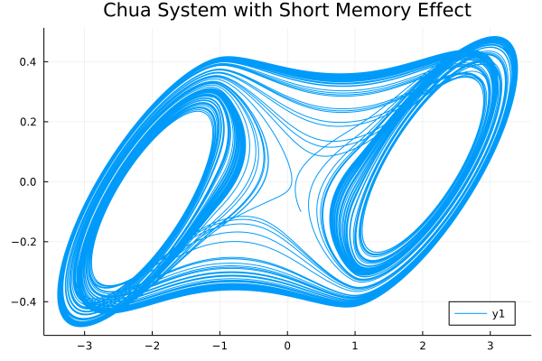
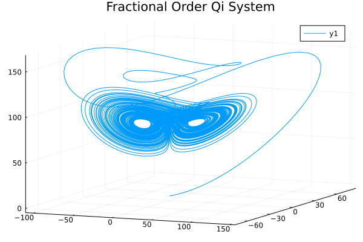

# System of fractional differential equations

Many "real life" situations are governed by a system of fractional differential equations.

##Fractional Order Chua System Example

So here, we will look at an example: [Chua circuit](https://en.wikipedia.org/wiki/Chua%27s_circuit).

The circuit diagram of the Chua system is shown below:


> Here, **``N_R``** is the [memoristor](https://en.wikipedia.org/wiki/Memristor), which is a non-linear electrical component relating electric charge and magnetic flux linkage.

Let's see if we abstract the Chua system into a fractional differential equation system:

```math
\begin{cases}
D^{\alpha_1}x=10.725\{y-1.7802x-[0.1927(|x+1|-|x-1|)]\}\\
D^{\alpha_2}y=x-y+z\\
D^{\alpha_3}z=-10.593y-0.268z
\end{cases}
```

Use the ```NonLinearAlg``` algorithm in FractionalDiffEq.jl to solve the Chua system and plot the result:

```julia
using FractionalDiffEq
using Plots

function chua(t, x, k)
    a = 10.725
    b = 10.593
    c = 0.268
    m0 = -1.1726
    m1 = -0.7872

    if k == 1
        f = m1*x[1]+0.5*(m0-m1)*(abs(x[1]+1)-abs(x[1]-1))
        y = a*(x[2]-x[1]-f)
        return y
    elseif k == 2
        y = x[1]-x[2]+x[3]
        return y
    elseif k == 3
        y = -b*x[2]-c*x[3]
        return y
    end
end

α = [0.93, 0.99, 0.92];
x0 = [0.2; -0.1; 0.1];
h = 0.001;
prob = FODESystem(chua, α, x0)
tn = 200;
result = solve(prob, h, tn, NonLinearAlg())

gr()
plot(result[:, 1], result[:, 2], title="Chua System", legend=:bottomright)
```


Cheers!🎉🎉🎉

It is noteworthy that in the reference book Fractional Calculus and Fractional-order Control[^1], the computing time is almost 20 minutes to solve this problem in [FOTF toolbox](https://www.mathworks.com/matlabcentral/fileexchange/60874-fotf-toolbox), in my own computer, the computing time of FOTF toolbox is **1499.940487** seconds while in FractionalDiffEq.jl, the computing time has a speedup of about two times, only cost **567.260306** seconds!!

### Short memory effect in FDE

!!! tip "Why we use short memory effect in simulation?"
    While the Chua system is a real life chaos system, when we want to simulate the system more to see the system more clearly, we must increase the simulating time ``t_n``, however, limited by the fact that the hardware resources and the computing capability can't increase endlessly, we need to use short memory effect to help us improve the simulating efficiency.

To further elaborate, we can look at how the short memory affects the simulation:

By using the same code above, but set ``t_n=500`` and memory length as ``L_0=10000`` to see the model more comprehensively but reduce the computing cost same time:

```julia
result = solve(chua, alpha, x0, h, tn, NonLinearAlg(), 10000)
```



While in the reference[^1], using FOTF toolbox costs 228.5s to solve the problem, in FractionalDiffEq.jl, the computing time is only almost 80s.

!!! info
    The cost time doesn't use any multi-threading or parallel computing speedup.
    ```julia-repl
    julia> Threads.nthreads()
    1
    ```
    So I think the performance would be more impressive by using multi-threading and paralell computing.

## Fractional Order Qi Chaotic System Example

Since the Qi chaotic system is depicted as:

```math
\begin{cases}
\dot{x_1}=a(x_1-x_2)+x_2x_3\\
\dot{x_2}=cx_1-x_2-x_1x_3\\
\dot{x_3}=x_1x_2-bx_3
\end{cases}
```

We can also obtain the fractional order Qi chaotic system:

```math
\begin{cases}
D^\alpha x_1=a(x_1-x_2)+x_2x_3\\
D^\alpha x_2=cx_1-x_2-x_1x_3\\
D^\alpha x_3=x_1x_2-bx_3
\end{cases}
```

By abstract the mathematical model, and solve the equation system:

```julia
using FractionalDiffEq
using Plots

function qi(t, x, y, z, k)
    a, b, c, d, r = 35, 8/3, 80, -1, 1
    if k == 1
        return -a*x+a*y+r*y*z
    elseif k == 2
        return c*x+d*y-x*z
    elseif k == 3
        return -b*z+x*y
    end
end

alpha = [0.98, 0.98, 0.98]
h=0.001
T=50
x0=[0.1, 0.2, 0.3]
prob = FODESystem(qi, alpha, x0)
x, y, z = solve(prob, h, T, GLWithMemory())

plot(x, y)
```

We can get the phase portrait of the Qi chaotic system:




[^1]: 分数阶微积分学与分数阶控制 薛定宇 ISBN:9787030543981 Page 208